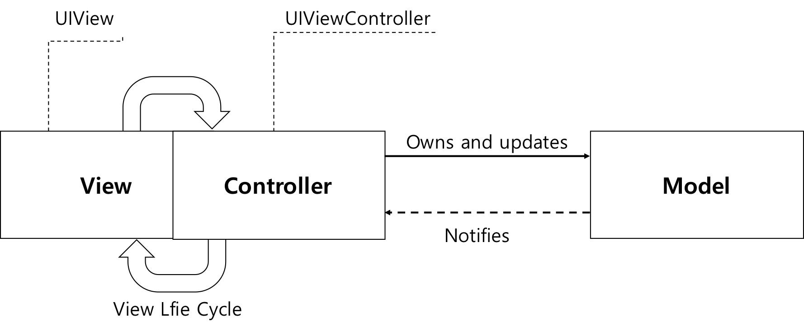
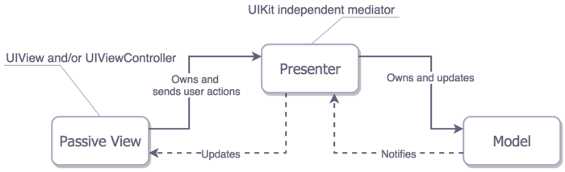

[Related Article - iOS Design Patterns👨‍💻](https://cielgrisdemoscou.github.io/blog/2020-09-03-design-pattern/)
<br />
<br />
There was a time, not too long back, when designing an iOS app meant relying on one of the three design patterns, namely, the singleton pattern, the decorator pattern, and the bridge design pattern. But, since these patterns started throwing up issues of interactions among client and server, **iOS moved towards the newer and better patterns of MVP, MVVM, MVC, and Viper.**

# Why start by choosing the appropriate app architecture🤔?

Mainly, it helps eliminate the possibility of having a nightmare when trying to implement additional features or debug some issues. The less code you write, the less chance there is of something going wrong, and the app architectures help prevent code duplication, bad programming practices, and messy code. This leads to a good base for a healthy code environment.

# MV(X) essentials💪
Nowadays we have many options when it comes to architecture design patterns:

- [MVC (Model-View-Controller)](https://en.wikipedia.org/wiki/Model–view–controller)

- [MVP (Model-View-Presenter)](https://en.wikipedia.org/wiki/Model–view–presenter)

- [MVVM (Model-View-View Model)](https://en.wikipedia.org/wiki/Model_View_ViewModel)

- [VIPER](https://www.objc.io/issues/13-architecture/viper/)

Before explaining the architectural patterns, basic concepts of Model and View should be explained: 

- Models - responsible for the domain data or a [data access layer](https://en.wikipedia.org/wiki/Data_access_layer) which manipulates the data, think of `‘Person’` or `‘PersonDataProvider’` classes.

- Views - responsible for the presentation layer (`GUI`), for iOS environment think of everything starting with `‘UI’` prefix.

- Controller/Presenter/ViewModel - the glue or the mediator between the `Model` and the `View`, in general responsible for altering the `Model` by reacting to the user’s actions performed on the `View` and updating the `View` with changes from the `Model`. 

Having entities divided allows us to:

- understand them better (as we already know)

- reuse them (mostly applicable to the View and the Model)

- test them independently

# MVC (Model-View-Controller)




```swift
import UIKit

struct Person { // Model
    let firstName: String
    let lastName: String
}

class GreetingViewController : UIViewController { // View + Controller
    var person: Person!
    let showGreetingButton = UIButton()
    let greetingLabel = UILabel()
    
    override func viewDidLoad() {
        super.viewDidLoad()
        self.showGreetingButton.addTarget(self, action: "didTapButton:", forControlEvents: .TouchUpInside)
    }
    
    func didTapButton(button: UIButton) {
        let greeting = "Hello" + " " + self.person.firstName + " " + self.person.lastName
        self.greetingLabel.text = greeting
        
    }
    // layout code goes here
}
// Assembling of MVC
let model = Person(firstName: "David", lastName: "Blaine")
let view = GreetingViewController()
view.person = model;
```

# MVP (Model-View-Presenter)



```swift
import UIKit

struct Person { // Model
    let firstName: String
    let lastName: String
}

protocol GreetingView: class {
    func setGreeting(greeting: String)
}

protocol GreetingViewPresenter {
    init(view: GreetingView, person: Person)
    func showGreeting()
}

class GreetingPresenter : GreetingViewPresenter {
    unowned let view: GreetingView
    let person: Person
    required init(view: GreetingView, person: Person) {
        self.view = view
        self.person = person
    }
    func showGreeting() {
        let greeting = "Hello" + " " + self.person.firstName + " " + self.person.lastName
        self.view.setGreeting(greeting)
    }
}

class GreetingViewController : UIViewController, GreetingView {
    var presenter: GreetingViewPresenter!
    let showGreetingButton = UIButton()
    let greetingLabel = UILabel()
    
    override func viewDidLoad() {
        super.viewDidLoad()
        self.showGreetingButton.addTarget(self, action: "didTapButton:", forControlEvents: .TouchUpInside)
    }
    
    func didTapButton(button: UIButton) {
        self.presenter.showGreeting()
    }
    
    func setGreeting(greeting: String) {
        self.greetingLabel.text = greeting
    }
    
    // layout code goes here
}
// Assembling of MVP
let model = Person(firstName: "David", lastName: "Blaine")
let view = GreetingViewController()
let presenter = GreetingPresenter(view: view, person: model)
view.presenter = presenter
```


# MVVM (Model-View-View Model)


**The latest and the greatest of the MV(X) kind**

```swift
import UIKit

struct Person { // Model
    let firstName: String
    let lastName: String
}

protocol GreetingViewModelProtocol: class {
    var greeting: String? { get }
    var greetingDidChange: ((GreetingViewModelProtocol) -> ())? { get set } // function to call when greeting did change
    init(person: Person)
    func showGreeting()
}

class GreetingViewModel : GreetingViewModelProtocol {
    let person: Person
    var greeting: String? {
        didSet {
            self.greetingDidChange?(self)
        }
    }
    var greetingDidChange: ((GreetingViewModelProtocol) -> ())?
    required init(person: Person) {
        self.person = person
    }
    func showGreeting() {
        self.greeting = "Hello" + " " + self.person.firstName + " " + self.person.lastName
    }
}

class GreetingViewController : UIViewController {
    var viewModel: GreetingViewModelProtocol! {
        didSet {
            self.viewModel.greetingDidChange = { [unowned self] viewModel in
                self.greetingLabel.text = viewModel.greeting
            }
        }
    }
    let showGreetingButton = UIButton()
    let greetingLabel = UILabel()
    
    override func viewDidLoad() {
        super.viewDidLoad()
        self.showGreetingButton.addTarget(self.viewModel, action: "showGreeting", forControlEvents: .TouchUpInside)
    }
    // layout code goes here
}
// Assembling of MVVM
let model = Person(firstName: "David", lastName: "Blaine")
let viewModel = GreetingViewModel(person: model)
let view = GreetingViewController()
view.viewModel = viewModel

```

# VIPER


**LEGO building experience transferred into the iOS app design**

```swift

import UIKit

struct Person { // Entity (usually more complex e.g. NSManagedObject)
    let firstName: String
    let lastName: String
}

struct GreetingData { // Transport data structure (not Entity)
    let greeting: String
    let subject: String
}

protocol GreetingProvider {
    func provideGreetingData()
}

protocol GreetingOutput: class {
    func receiveGreetingData(greetingData: GreetingData)
}

class GreetingInteractor : GreetingProvider {
    weak var output: GreetingOutput!
    
    func provideGreetingData() {
        let person = Person(firstName: "David", lastName: "Blaine") // usually comes from data access layer
        let subject = person.firstName + " " + person.lastName
        let greeting = GreetingData(greeting: "Hello", subject: subject)
        self.output.receiveGreetingData(greeting)
    }
}

protocol GreetingViewEventHandler {
    func didTapShowGreetingButton()
}

protocol GreetingView: class {
    func setGreeting(greeting: String)
}

class GreetingPresenter : GreetingOutput, GreetingViewEventHandler {
    weak var view: GreetingView!
    var greetingProvider: GreetingProvider!
    
    func didTapShowGreetingButton() {
        self.greetingProvider.provideGreetingData()
    }
    
    func receiveGreetingData(greetingData: GreetingData) {
        let greeting = greetingData.greeting + " " + greetingData.subject
        self.view.setGreeting(greeting)
    }
}

class GreetingViewController : UIViewController, GreetingView {
    var eventHandler: GreetingViewEventHandler!
    let showGreetingButton = UIButton()
    let greetingLabel = UILabel()

    override func viewDidLoad() {
        super.viewDidLoad()
        self.showGreetingButton.addTarget(self, action: "didTapButton:", forControlEvents: .TouchUpInside)
    }
    
    func didTapButton(button: UIButton) {
        self.eventHandler.didTapShowGreetingButton()
    }
    
    func setGreeting(greeting: String) {
        self.greetingLabel.text = greeting
    }
    
    // layout code goes here
}
// Assembling of VIPER module, without Router
let view = GreetingViewController()
let presenter = GreetingPresenter()
let interactor = GreetingInteractor()
view.eventHandler = presenter
presenter.view = view
presenter.greetingProvider = interactor
interactor.output = presenter

```

## References

More information on Markdown can be found at the following links:

- [Apple Model-View-Controller](https://developer.apple.com/library/archive/documentation/General/Conceptual/CocoaEncyclopedia/Model-View-Controller/Model-View-Controller.html)
- [Github awesome iOS architecture](https://github.com/onmyway133/awesome-ios-architecture)
- [Blog K7 Tech Agency](https://k7tech.agency/blog/ios-app-architecture-patterns)
- [Medium Which design architecture is suitable for iOS](https://medium.com/@vigneshwaran_89879/mvc-vs-mvvm-vs-mvp-vs-viper-which-design-architecture-is-suitable-for-ios-bb1f32328bd8)
- [Medium iOS Architecture Patterns](https://medium.com/ios-os-x-development/ios-architecture-patterns-ecba4c38de52)
